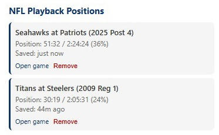

# NFL Playback Position Saver

A browser extension (Chrome and Firefox) that remembers your playback position for NFL+ game replays. NFL+ does not natively save your position when watching replays, so this extension fills that gap.

The Chrome version is available in the Chrome Web Store [here](https://chromewebstore.google.com/detail/nfl-playback-position-sav/mkfajpdocmiaehhmoglmanbphpeogedo).

The Firefox version is available in the Firefox add-on marketplace [here](https://addons.mozilla.org/en-US/firefox/addon/nfl-playback-position-saver/).



## What it does

- Automatically detects when you're watching a game on `nfl.com/plus/games/*`
- Saves your playback position every 5 seconds, on pause, and before the page closes
- When you return to the same game, it restores your position automatically
- All data is stored locally in your browser (nothing is sent anywhere)

Click the extension icon to see all your saved games, their positions, and links to resume watching.

## Installation

### Chrome

1. Clone or download this repository
2. Open Chrome and navigate to `chrome://extensions`
3. Enable **Developer mode** (toggle in the top-right corner)
4. Click **Load unpacked**
5. Select the `chrome/` subdirectory of this repository

### Firefox

1. Clone or download this repository
2. Open Firefox and navigate to `about:debugging#/runtime/this-firefox`
3. Click **Load Temporary Add-on…**
4. Select `firefox/manifest.json` in this repository

Firefox unloads temporary add-ons when the browser restarts. To install permanently, package a signed XPI (see "Publishing to Firefox Add-ons" below).

After installing in either browser, navigate to any NFL+ game replay and your position will be saved automatically.

## Files

The repository contains two parallel extension builds — `chrome/` and `firefox/` — with identical source files. The only difference is that `firefox/manifest.json` adds the `browser_specific_settings.gecko.id` that Firefox requires.

| File (in each of `chrome/` and `firefox/`) | Purpose |
|------|---------|
| `manifest.json` | Extension manifest (Manifest V3) |
| `content.js` | Content script that saves/restores video position |
| `popup.html` | Extension popup UI |
| `popup.js` | Popup logic — lists saved games with positions |

When changing source files, update both `chrome/` and `firefox/` so the two builds stay in sync.

## Publishing to the Chrome Web Store

If you want to publish this extension publicly:

### One-time setup

- Create a [Chrome Web Store Developer account](https://chrome.google.com/webstore/devconsole/) using a Google account
- Pay a one-time $5 registration fee

### Prepare assets

- **Icons** — The store requires a 128x128 icon (and ideally 16x16 and 48x48 for the extension toolbar). Add them to the project and update `manifest.json`.
- **Screenshots** — At least one 1280x800 or 640x400 screenshot showing the extension in action
- **Privacy policy** — Since the extension only uses local storage and does not collect or transmit any user data, a simple statement to that effect is sufficient

### Submit

1. Zip the contents of the `chrome/` subdirectory (the zip must have `manifest.json` at its root, not nested in a folder)
2. Upload the zip in the Developer Dashboard
3. Fill out the listing: description, category, screenshots, icons
4. Complete the privacy practices questionnaire (no remote code, no data collection, single purpose: saving playback position)
5. Submit for review

Google typically reviews submissions within 1-3 business days. A simple extension like this should pass without issues. Updates go through the same review process.

## Updating the published Chrome extension

1. Increment the version number in `chrome/manifest.json`
2. Zip the contents of `chrome/`:
   ```
   cd c:/git/nfl-playback-automation/chrome
   powershell -Command "Compress-Archive -Path manifest.json, content.js, popup.html, popup.js, icon-48.png, icon-64.png, icon-128.png, icon-256.png -DestinationPath 'g:\temp\nfl-playback-position-saver.zip' -Force"
   ```
3. In the Chrome Web Store Developer Dashboard, click on the extension to open its listing
4. Click **Package** in the left sidebar and upload the new zip file
5. If the update adds or broadens permissions, the dashboard will prompt for justifications — fill these in
6. Click **Submit for review**

Google typically reviews updates within 1-3 business days. Existing users will auto-update once approved.

## Publishing to Firefox Add-ons (AMO)

The Firefox build lives in `firefox/`. Mozilla's developer hub is at [addons.mozilla.org/developers](https://addons.mozilla.org/developers/). You can either list the extension on AMO (public distribution, reviewed) or self-distribute a signed XPI. Either path requires a free developer account and that the submitted archive is signed by Mozilla.

To produce the archive for submission:

```
cd c:/git/nfl-playback-automation/firefox
powershell -Command "Compress-Archive -Path manifest.json, content.js, popup.html, popup.js, icon-48.png, icon-64.png, icon-128.png, icon-256.png -DestinationPath 'g:\temp\nfl-playback-position-saver-firefox.zip' -Force"
```

Upload the zip through the AMO developer hub; Mozilla's review/signing process produces the final XPI.

## Development notes

- **Always increment the version number** in both `chrome/manifest.json` and `firefox/manifest.json` with any code change, even minor ones. This lets you verify that an update was picked up after reloading the extension (Chrome: `chrome://extensions`; Firefox: `about:debugging`). The current version is shown on the extension's card.
- When editing source files, update the copies in both `chrome/` and `firefox/`. The two builds are intentionally kept as byte-identical source mirrors; only the manifests differ.
